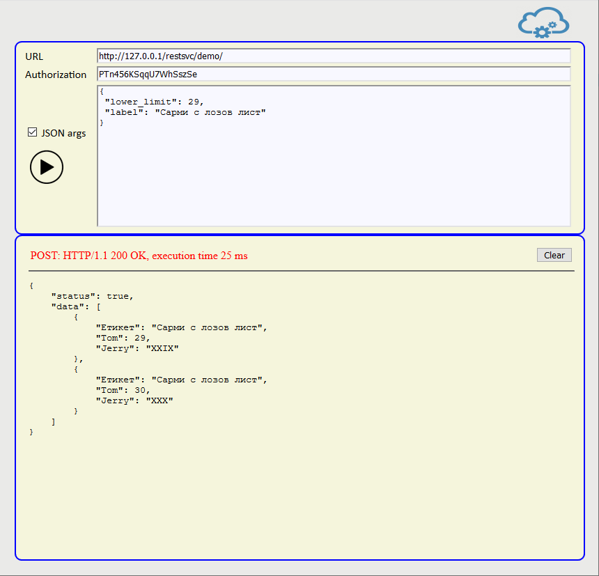

# ***restql*** - RESTful web services in SQL
### SQL query to RESTful service generator in PHP


## About
***restql*** is a simple __vanilla platform with no dependencies__ that wraps and exposes parameterized SQL queries as JSON web services in a flexible and secure way. 
The implementation and sample service run on PHP and [PostgreSQL](https://www.postgresql.org/). Any other DBMS with PDO support and the corresponding PDO driver installed can be used.

Here is an example. Consider this trivial query:
```sql
SELECT
    current_number AS "Tom",
    to_char(current_number, 'FMRN') AS "Jerry"
 FROM generate_series (1, 1000, 1) AS t (current_number)
 WHERE current_number BETWEEN :lower_limit AND :upper_limit
 LIMIT 100;
```
Let's make a web service out of it. In a web service environment arguments might be lower_limit = 15 and upper_limit = 19.
As a JSON object (this might be the service request data) they will look like this
```json
{
 "lower_limit": 15,
 "upper_limit": 19
}
```
After the query is run then the raw resultset would be this
```text
|Tom|Jerry  |
|---|-------|
|15 |"XV"   |
|16 |"XVI"  |
|17 |"XVII" |
|18 |"XVIII"|
|19 |"XIX"  |
```
As a JSON array (this would be part of the service response data) the resultset would be this
```json
[
  {
      "Tom": 15,
      "Jerry": "XV"
  },
  {
      "Tom": 16,
      "Jerry": "XVI"
  },
  {
      "Tom": 17,
      "Jerry": "XVII"
  },
  {
      "Tom": 18,
      "Jerry": "XVIII"
  },
  {
      "Tom": 19,
      "Jerry": "XIX"
  }
]
```
The service definition would comprise of the parameterized sql query in a text file and a service definition file called `<service_name>.config.json` that references the sql file. One sql file may be referred to by more than one service definition.
Additionally post-processing may be done after the query has finished running (see below).  
The following response modes are supported:

 - returning the entire query rowset as a JSON array of objects
 - returning a single row as a JSON object
 - returning a single value as is
 - returning a JSON value
 - returning no result

## Sample server deployment on Apache httpd, PHP and PostgreSQL
- Download ***restql***;
- Create a folder for your `<base_url>` in the www folder;
- Extract the ***restql*** files into it;
- Modify `include/db.connection.config` to connect to your [PostgreSQL](https://www.postgresql.org/) database;
- Modify or remove `include/db.account.config` (see below);
- Either create an activity log database table and modify `include/logger.sql.config` accordingly (see below) or
- rename/remove `include/logger.sql.config` to disable activity logging.  

Now the details

## Service generator constructor

A service generator server is created via instantiation of the `Restql` class and providing paths to the server instance configuration folder and service configuration definitions folder.  
`Restql::__construct(<instance config>, <service config>);`
 - `<instance config>` - path to the server instance configuration folder without trailing path separator
 - `<service config>` - path to the service definitions folder without trailing path separator

## Server example
In this example `<instance config>` is a folder called `include` above base folder and `<service config>` is a folder called `services` above base folder.

 - Folder structure

```text
<base folder>
             ├file '.htaccess'
             ├file 'restql.php'
             ├folder 'include'
             │       ├file 'restql.class.php'
             │       ├file 'db.connection.config'
             │       ├file 'db.account.config'
             │       └file 'logger.sql.config'
             ├folder 'services'
             │       ├file 'demo.config.json'
             │       ├file 'demo.new.sql'
             │       └file 'demo.postprocess.php'
             └folder 'logs'
                     └file 'debug.log.txt'
```
 - File _restql.php_
```php
<?php
 require('include/restql.class.php');
 $svc = new Restql
 (
 	__DIR__.DIRECTORY_SEPARATOR.'include', 
 	__DIR__.DIRECTORY_SEPARATOR.'services'
 );
 $svc -> handle();
```
 - File _restql.class.php_

 The main (and only) ***restql*** source file that contains Restql class definition.  
 Restql class has only one public method (except the constructor) - `Restql::handle()`
 
## Server configuration

Server configuration resides in a folder called `include` above base folder. It comprises of these files:
 - File _db.connection.config_ (mandatory)  
   contains a PDO connection string **(for performance purposes consider connection pooling)**.

```ini
pgsql:
 dbname=sampledb;
 host=172.30.0.100;
 port=5432;
 user=sampleUser;
 password=samplePassword;
```

 - File _db.account.config_ (optional)  
   contains database user credentials (username ana password) in JSON format. Used when these are not contained in the connection string.  

```json
{
 "username": "sampleUser",
 "password": "samplePassword"
}
```

 - File _logger.sql.config_ (optional)  
   contains a parameterized SQL query with exactly these three parameters:  
   `call_by`, `call_resource`, `call_payload`

```sql
insert into scratch.restql_log
(
 call_by, call_resource, call_payload
)
values
(
 :call_by, :call_resource, :call_payload
);
```
 - Sample log table DDL **(you must create one so that the logger SQL query can work)**

```sql
create table scratch.restql_log
(
  call_time timestamp not null default now(),
  call_by text not null,
  call_resource text not null,
  call_payload text not null,
  constraint restql_log_pkey primary key (call_time, call_by)
);
```
## Service definition

Service definitions reside in `services` (i.e. `<service config>`) folder. Each comprises of these three files:
 - `<service_name>.config.json` - mandatory, contains service metadata
 - `<sql_file_name>.sql` - mandatory, contains the service query
 - `<postprocess_file_name>.php` - optional

_The service example executes a parametrized SQL query and returns a table._  
_See demo.config.json and demo.new.sql in the example below._

`<sql_file_name>.sql` file contains a single parameterized SQL query. Advanced SQL features (CTEs, window functions, etc.) and database server programming (stored procedures/functions) alike can be used in order to implement complex data logic.

`<service_name>.config.json` file contains service metadata and arguments' definitions.  

___

**NOTE:**
- A JSON schema file for validation of `<service_name>.config.json` files and a CLI script for generating runtime arguments' validation JSON schema are available in [resources](resources) folder. 
- A web GUI for testing and debugging is available in [restclient](examples/restclient) folder. 

___

- File _demo.config.json_
```json
{
	"settings":
	{
		"token": "PTn456KSqqU7WhSszSe",
		"query": "demo.new.sql",
		"response": "table",
		"postprocess": false,
		"iplist": ["172.30.0.0/25", "172.30.0.132", "127.0.0.1"]
	},
	"arguments":
	{
		"lower_limit": {"type": "number", "default": 25},
		"upper_limit": {"type": "number", "constant": 30},
		"label":       {"type": "text",   "default": "Just a label", "pattern": "/^[A-ZА-Я 0-9]+$/ui"}
	}
}
```
### *settings* section

- **token** - mandatory text, a security token. The example was generated by [Random.org](https://www.random.org/passwords/?num=1&len=24&format=plain&rnd=new).  
 The same token value must be used to both define and invoke the service.
```json
Example: "token": "PTn456KSqqU7WhSszSe"
```
- **query** - mandatory text  
 The file name of the service sql query
```json
Example: "query": "demo.new.sql"
```

- **response** - mandatory text, one of the predefined response modes listed below

|mode| description|
|---|---|
|"table"| for row set returning queries. Rows are retrieved by `PDOStatement::fetchAll()` method and sent as an array of JSON objects|
|"row"| for single row returning queries. A single row is retrieved by `PDOStatement::fetch()` method and sent as a JSON object|
|"value"| for value returning queries. A single value is retrieved by `PDOStatement::fetchColumn()` method and sent as is|
|"jsonvalue"| for json-returning queries. A single value is retrieved by `PDOStatement::fetchColumn()` method and sent as JSON|
|"void"| no data is returned|

```json
Example: "response": "table"
```
 - **postprocess** - optional text  
 The postprocess PHP file name (if any) or `false`
```json
Example: "postprocess":  "demo.postprocess.php"
```
 - **iplist** - optional array of text representing IP ranges. If present then only caller IPs within these ranges are allowed
```json
Example: "iplist": ["172.30.0.0/25", "172.30.0.132", "127.0.0.1"]
```

### *arguments* section

Service arguments are defined as `"argument_name": <argument description>`

argument description attributes:

|Attribute | Required | Type | Description|
|---|---|---|---|
|"type"|Yes|text|Argument data type. One of "number", "text", "boolean"|
|"default"|No|varying|Default value. Makes the service argument optional|
|"constant"|No|varying|Non-overridable default value|
|"pattern"|No|text|Regular expression for validation. Applicable to text arguments only|

```text
Example: "lower_limit": {"type": "number", "default": 25}
Example: "upper_limit": {"type": "number", "constant": 30}
Example: "label":       {"type": "text", "default": "Just a label", "pattern": "/^[A-ZА-Я 0-9]+$/ui"}
```
**NOTE:** Either "default" or "constant" or none of them may be specified but not both  
**NOTE:** The `u` regex switch enables extended (cyrillic, greek, accented) characters matching.
 - File _demo.new.sql_

```sql
SELECT
    cast(:label AS text) AS "Етикет",
    current_number AS "Tom",
    to_char(current_number, 'FMRN') AS "Jerry"
 FROM generate_series (1, 1000, 1) AS t (current_number)
 WHERE current_number BETWEEN :lower_limit AND :upper_limit
 LIMIT 100;
```
**NOTE:** Arguments in .config.json and parameters in .sql files must match exactly by name and number. SQL parameter names are prefixed with a colon (:).

## A word of caution

Although SQL injection is taken care about by using PDO prepared statements an extra line of defence is never one too many. Therefore using regular expression patterns for arguments validation in `<service_name>.config.json` files is always a good idea.

## A word on encoding

Always encode response JSON in UTF-8. The straightforward way to do this is to add `charset=utf8` in the `db.connection.config` file. This DSN setting is supported since PHP 5.3.6 and works for 
[Oracle](http://php.net/manual/en/ref.pdo-oci.connection.php), [SQL Server](http://php.net/manual/en/ref.pdo-dblib.connection.php) and [MySQL](http://php.net/manual/en/ref.pdo-mysql.connection.php) alike. For [PostgreSQL](https://www.postgresql.org/) (in this example) UTF-8 is usually the native client encoding.

**NOTE:** Byte order marks (i.e. [BOM](https://en.wikipedia.org/wiki/Byte_order_mark)) in ***restql***-related files can cause a lot of trouble. Make sure that you save your files without a BOM.  

## Post-processing

It is possible to invoke a PHP script after the database query has finished. This will not affect the sql query response.
In order to setup a post-process script `<service_name>.config.json` file must contain the following option in the `settings` section:
```json
"postprocess": "<postprocess_file_name>.php"
```
The PHP script itself resides in file `<postprocess_file_name>.php` in the `services` folder (i.e. `<service config>`).  
```php
function postProcess($args, $response_data, $dbConn)
/*
$args - a tagged array of the service arguments
$response_data - native 'data' part of the response
$dbConn - the PDO connection
*/
``` 
must be defined in the file. It that will be called to do the post-processing. Whatever is returned by this function will be put into the service response as 'extra'.  

A sample post-processing file called `demo.postprocess.php` is provided but not referenced in `demo.config.json` and therefore it does not get invoked. In order to do so change 
```json
"postprocess": false
```
to
```json
"postprocess": "demo.postprocess.php"
```
in file `demo.config.json`.  

**NOTE:** Use post-processing with utmost care

## Logging

- Activity is logged by invoking the SQL query in `include/logger.sql.config` file (if any) for every call;
- Errors are logged in file `logs/debug.log.txt`.

## URL rewrite
 - File _.htaccess_

```text
# Important: AllowOverride All in httpd.conf

RewriteEngine On
RewriteRule ^svc/(\w+)$           restql.php?$1           [NC,L]
RewriteRule ^svc/(\w+)/revision$  restql.php?$1/revision  [NC,L]

order deny,allow
<files *.*>
	deny from all
</files>
<filesmatch \.php$>
	allow from all
</filesmatch>
```
## Service invocation
 - URL with URL rewrite:
   `<base_url>/svc/<service_name>`
 - URL without URL rewrite
   `<base_url>/restql.php?<service_name>`
 - Method: `POST`
 - The security token is sent as `Authorization` request header
 - Call arguments are POST-ed as JSON

#### Service revision check
 - URL with URL rewrite
 `<base_url>/svc/<service_name>/revision`

 - URL without URL rewrite
 `<base_url>/restql.php?<service_name>/revision`

## Service response

JSON with this structure:

```text
{
 "status": true or false,
 "data": return data in JSON or error text,
 "extra": optional, the return value of postProcess function if any
}
```
## Call example

 - URL with URL rewrite: `<base_url>/svc/demo`
 - URL without URL rewrite: `<base_url>/restql.php?demo`

#### POST data

```json
{
 "lower_limit": 29,
 "label": "Сарми с лозов лист"
}
```

#### cURL
```
curl -X POST -H 'Authorization: PTn456KSqqU7WhSszSe' -i http://localhost/servicegen/svc/demo --data '{
 "lower_limit": 29,
 "label": "Сарми с лозов лист"
}'
```

<div style="page-break-after: always;"></div>

