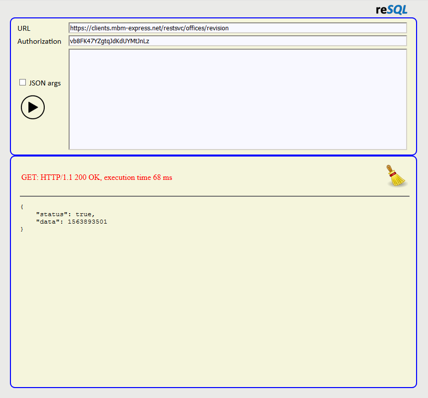

## ***restclient*** simplistic restql client  

***restclient*** is a frugal pure vanilla web GUI example. You can use it to test and debug restql services.

if *JSON args* is __**not**__ checked then GET request method is used, otherwise - POST.

